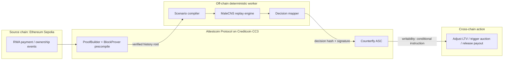

# Counterfly

> A reproducible counterfactual-history engine for real-world asset (RWA) risk, powered by a cyber fruit-fly connectome and Attestcoin-verified cross-chain data.

**Counterfly** turns a real fruit-fly connectome (`MaleCNS v1.0`) into a deterministic stress-testing and valuation primitive for tokenized real-world assets. Instead of trusting a centralized appraiser, rating agency, or black-box ML model, anyone can download the same connectome, feed the same Attestcoin-verified history, and reproduce the same risk decision.

> Cypherpunk core idea: **"Don't trust the appraiser — reproduce the fly."**

---

## 1. Background

### 1.1 The RWA trust gap

Tokenized real-world assets promise to bridge off-chain value with on-chain transparency. In practice, most RWA systems are transparent about *ownership and transfers*, but opaque about *value and risk*:

- A single appraiser or oracle decides the valuation, loan-to-value (LTV), or default signal.
- That appraiser is a single point of failure: it can be wrong, captured, slow, or unavailable.
- Risk models are usually proprietary black boxes. A lender cannot audit *why* the system says "12.4% default risk".

This recreates, inside a supposedly trustless system, the exact trusted third party that blockchains were meant to remove.

### 1.2 The cyber fruit-fly moment

In September 2026, the **MaleCNS v1.0** dataset made a complete adult male fruit-fly central nervous system available as machine-readable data:

- ~166,700 neurons
- ~25.6 million directed connections
- ~124 million synaptic contacts

Within days, developers began turning that static wiring diagram into a *runnable biological network*. The best-known example, **Stonkfly**, renders a Bitcoin price chart as visual stimuli, feeds it into the connectome, reads motor-neuron activity, and maps the result to `buy / sell / hold`.

The deeper shift is not "a fly trades crypto". It is that a biological connectome has become a **forkable, reproducible computational object**. Anyone can load the same graph, apply the same dynamics, and re-run the same experiment.

### 1.3 Why counterfactual history?

Forecasting is fragile; replay is auditable.

Counterfly does **not** predict the future. It replays verified history and alternative "what-if" scenarios through the same connectome, then maps the network's escape/approach/avoid-like motor output to a small set of risk actions. The result is a risk signal that anyone can audit and re-run — not a proprietary score that must be trusted.

This is the **counterfactual-history engine**: it answers "what would this biological decision network have done under a different interest-rate path, a missed payment, or a climate shock?" and turns that answer into a deterministic RWA risk action.

---

## 2. Problem statement

On-chain RWA is transparent about *what is owned and moved*, but opaque about *what it is worth and how risky it is*, because the critical risk decisions still come from a centralized, non-reproducible oracle. The result is a trust gap that defeats the purpose of tokenization.

---

## 3. Solution

Counterfly closes the gap with three layers:

1. **Attest (verify)** — Attestcoin reads and cryptographically verifies cross-chain RWA events (payments, ownership transfers, sensor/index data) into Creditcoin.
2. **Replay (reproduce)** — a deterministic fruit-fly connectome simulation replays the verified history plus one or more counterfactual scenarios.
3. **Commit (act)** — an Attestcoin Smart Contract (ASC) records the resulting decision hash on Creditcoin and, when a threshold is met, writes a cross-chain action (adjust LTV, trigger an auction, release a payout).

The decision is the product of an **open biological graph**, not a closed institution.

---

## 4. Innovation highlights

- **Reproducible biological oracle** — replace "trust me" with "run it yourself". The risk engine is a forkable 166,700-neuron graph, not a company.
- **Counterfactual-history engine** — risk as an auditable replay of verified history and alternative scenarios, not a black-box forecast.
- **Cypherpunk by design** — verification over authority; no single operator can unilaterally falsify the input or the outcome.
- **Deep Attestcoin integration** — a closed `read → replay → write` loop across Ethereum Sepolia and Creditcoin, using attested source events, on-chain verification, ASC business logic, and cross-chain writability.

---

## 5. Architecture



---

## 6. Attestcoin integration summary

| Layer | Implementation |
| --- | --- |
| Source chain | Ethereum Sepolia (`chainKey = 1`) |
| Destination chain | Creditcoin CC3 testnet |
| Read path | `ProofBuilder` + `BlockProver` precompile verifies RWA payment/ownership events |
| Compute path | Deterministic off-chain `MaleCNS` replay worker (hash-pinned, open-source) |
| Write path | `Counterfly ASC` stores the decision; a relayer bridge sends a conditional instruction back to Sepolia (native writability pending testnet release) |

The project is built on the official [attestcoin-protocol-examples](https://github.com/gluwa/attestcoin-protocol-examples) tutorials, extending the cross-chain loan example with the connectome replay engine.

---

## 7. Repository layout

```text
counterfly/
├── package.json          # npm workspaces root
├── README.md
├── PRD.md
├── docs/
│   └── TECHNICAL.md
├── contracts/
│   ├── contracts/        # CounterflyASC.sol, RwaAction.sol
│   ├── scripts/          # deployment scripts
│   └── test/             # Hardhat unit tests
├── worker/
│   ├── src/              # attest -> scenario -> replay -> commit orchestrator
│   └── fly/              # Python connectome engine + data prepare script
└── dashboard/            # Vite + React risk dashboard
```

---

## 8. Quick start

> Full setup is described in [docs/TECHNICAL.md](docs/TECHNICAL.md).

```bash
git clone <this-repo>
cd counterfly

# 1. Install dependencies
npm install

# 2. Configure RPCs for Sepolia and CC3 testnet
cp .env.example .env

# 3. Compile and test the contracts
npm run compile -w @counterfly/contracts
npm run test -w @counterfly/contracts

# 4. Run the offline demo (no keys or network required)
npm run demo -w @counterfly/worker
npm run demo -w @counterfly/worker -- --scenario=RATE_SHOCK

# 5. Start the worker API
npm run serve -w @counterfly/worker

# 6. Start the dashboard (in another terminal)
npm run dev -w @counterfly/dashboard
```

The dashboard runs the replay first, then exposes **Commit to CC3** and
**Relay to Sepolia** actions so the cross-chain write-back can be demonstrated
step by step.

To replay on the **real MaleCNS v1.0 connectome** (166,700 neurons), set up the
Python environment and export the Janelia data once:

```bash
python3 -m venv worker/fly/.venv
worker/fly/.venv/bin/pip install numpy pyarrow pandas
npm run prepare:full -w @counterfly/worker
npm run demo:full -w @counterfly/worker
```

For a real cross-chain run, deploy the ASC to CC3 testnet, set `PRIVATE_KEY`
and `COUNTERFLY_ASC_ADDRESS` in `.env`, then run:

```bash
npm run deploy:cc3 -w @counterfly/contracts
npm run run -w @counterfly/worker -- 0x<sepolia-tx-hash>
```

The default demo graph is a small deterministic pruned graph. To export the
real `MaleCNS v1.0` connectome, see `worker/fly/prepare.py`.

The dashboard talks to the worker API at `http://localhost:8787` by default.
Use the **Demo brain / MaleCNS v1.0** switch to replay either the pruned graph
or the prepared real connectome. Native Attestcoin writability is not yet
released on CC3 testnet, so the current cross-chain write-back uses the
`worker/src/relay.ts` bridge.

---

## 9. Status

This project is an original submission for **BUIDL CTC 2026 Fall**, **RWA track**, built on the **Attestcoin Protocol**.

---

## 10. Attribution and license

- Connectome data: **MaleCNS v1.0**, Janelia Research Campus / HHMI, University of Cambridge, Google Research, and collaborators. Data is used as open scientific input; Counterfly is original application work.
- Conceptually inspired by the 2026 "cyber fruit fly" wave (e.g., Stonkfly), but the code, architecture, and RWA/counterfactual framing are original.

Licensed under the [MIT License](LICENSE).
