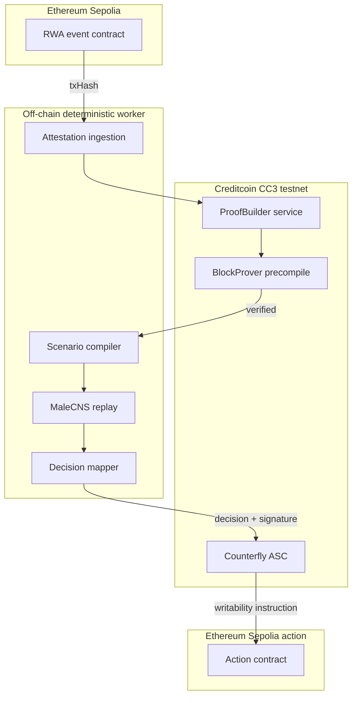

# Counterfly — Technical Documentation

## 1. System overview

Counterfly is a three-stage pipeline:

1. **Attest** — ingest a source-chain RWA event and verify it on Creditcoin using the Attestcoin Protocol.
2. **Replay** — compile verified history and a counterfactual scenario into sensory inputs for a deterministic fruit-fly connectome simulation.
3. **Commit** — map the connectome output to a risk action, record it in an Attestcoin Smart Contract (ASC), and optionally write a cross-chain instruction.

The architecture is intentionally simple: the *novelty* is the reproducible biological decision layer, while the *value* is carried by the Attestcoin read/write loop.

## 2. Architecture



## 3. Components

### 3.1 Attestation ingestion (Attestcoin read layer)

The worker accepts a source-chain transaction hash and verifies it using the official SDK.

```ts
import { JsonRpcProvider } from 'ethers';
import { chainInfo, blockProver, proofProvider } from '@gluwa/usc-sdk';

const sourceProvider = new JsonRpcProvider('https://sepolia.infura.io/v3/<key>');
const creditcoinProvider = new JsonRpcProvider('https://rpc.cc3-testnet.creditcoin.network');

const CHAIN_KEY = 1; // Ethereum Sepolia on CC3 testnet
const prover = new blockProver.PrecompileBlockProver(creditcoinProvider);
const proofBuilder = new proofProvider.service.ProofBuilder(
  CHAIN_KEY,
  'https://prover.cc3-testnet.creditcoin.network',
);

async function verifyEvent(txHash: string): Promise<boolean> {
  const tx = await sourceProvider.getTransaction(txHash);
  await proofBuilder.waitUntilHeightAttested(CHAIN_KEY, tx!.blockNumber!);

  const result = await proofBuilder.getProof(txHash);
  if (!result.success || !result.data) {
    throw new Error(result.error);
  }

  const { headerNumber, txBytes, merkleProof, continuityProof } = result.data;
  return prover.verifySingle(
    CHAIN_KEY,
    headerNumber,
    txBytes,
    merkleProof,
    continuityProof,
  );
}
```

Verified events are normalized into a canonical history entry:

```text
history_entry = {
  asset_id,
  event_type,      // PAYMENT, OWNERSHIP_TRANSFER, SENSOR_READING, INDEX_TICK
  amount_or_value,
  timestamp,
  source_tx_hash,
  attested_block
}
```

The full history is Merkle-ized and referenced by a `historyMerkleRoot` in the scenario.

### 3.2 Scenario compiler

A scenario bundles an attested history root with a counterfactual perturbation:

```text
scenario = {
  asset_id,
  history_merkle_root,
  counterfactual = {
    type,          // RATE_SHOCK, MISSED_PAYMENT, HAZARD, BASE_REPLAY
    magnitude,
    horizon
  }
}
```

The compiler renders the scenario into a fixed-size multi-channel input, such as time-series images or current injections, so that the same scenario always maps to the same sensory stimulus.

### 3.3 Connectome replay engine

Counterfly uses the open `MaleCNS v1.0` connectome as its decision substrate. For the hackathon demo we support two modes:

- **Pruned mode** — a deterministic subset of the graph, tuned to run live in seconds.
- **Full mode** — the retained `MaleCNS v1.0` graph, for reproducible offline audit runs.

```python
@dataclass
class Scenario:
    history_root: bytes
    counterfactual: Counterfactual

def run_replay(graph: FlyGraph, scenario: Scenario, seed: int = 0) -> MotorReadout:
    stimuli = encode_sensory(scenario)      # deterministic history + scenario -> inputs
    spikes = simulate(graph, stimuli, seed) # fixed dynamics, fixed seed
    return decode_motor(spikes)             # escape / approach / avoid-like axis
```

The replay is deterministic because:

- The connectome graph version is pinned.
- Input encoding is a pure function of the scenario.
- Simulation parameters and random seed are fixed.
- Library versions are recorded in a lockfile.

### 3.4 Decision mapper

Motor readout is mapped to a small action set. Thresholds are published so the mapping is auditable:

| Action | Meaning | Example RWA effect |
| --- | --- | --- |
| `0 HOLD` | No change | Keep current LTV |
| `1 ADJUST_LTV` | Reduce risk | Lower LTV by `newLtvBps` |
| `2 LIQUIDATE` | Exit position | Trigger collateral auction |
| `3 PAY_OUT` | Release funds | Parametric insurance payout |

### 3.5 ASC commit and cross-chain write

The decision is committed to the Counterfly ASC on CC3 testnet.

```solidity
// SPDX-License-Identifier: MIT
pragma solidity ^0.8.24;

interface ICounterflyASC {
    struct Scenario {
        bytes32 assetId;
        bytes32 historyMerkleRoot;
        bytes32 scenarioHash;
        uint256 timestamp;
    }

    struct Decision {
        bytes32 replayHash;
        uint8 action; // 0 HOLD, 1 ADJUST_LTV, 2 LIQUIDATE, 3 PAY_OUT
        uint256 newLtvBps;
        uint256 thresholdBps;
    }

    event ScenarioSubmitted(bytes32 indexed assetId, bytes32 scenarioHash);
    event DecisionCommitted(bytes32 indexed assetId, bytes32 replayHash, uint8 action);

    function submitScenario(Scenario calldata s) external;
    function commitDecision(Decision calldata d, bytes calldata signature) external;
    function latestDecision(bytes32 assetId) external view returns (Decision memory);
}
```

The writability path is a conditional instruction from the ASC to a Sepolia action contract. In the demo, this is a guarded `requestLiquidation` or `adjustLtv` call that the ASC can emit after a decision crosses a threshold.

### 3.6 Dashboard

The dashboard shows:

- Attested source events and their on-chain verification status.
- The active scenario and counterfactual parameters.
- Live replay state and motor readout.
- The committed decision hash and cross-chain action status.
- A "how to reproduce" panel with the exact pinned inputs and seed.

## 4. Attestcoin integration details

### 4.1 Environments

| Environment | Value |
| --- | --- |
| CC3 testnet RPC | `https://rpc.cc3-testnet.creditcoin.network` |
| ProofBuilder service | `https://prover.cc3-testnet.creditcoin.network` |
| Decoder contract | `0x731c345d79Fb8BbDC541f9DF3b6317585F849F9f` |
| ChainInfo precompile | `0x0000000000000000000000000000000000000fd3` |
| BlockProver precompile | `0x0000000000000000000000000000000000000FD2` |

### 4.2 Supported source chains (CC3 testnet)

| Chain key | Chain | Genesis block |
| --- | --- | --- |
| 1 | Ethereum Sepolia | 0 |
| 3 | Ethereum Mainnet | 0 |

The demo uses **Ethereum Sepolia** (`chainKey = 1`) because it matches the testnet flow.

### 4.3 Read flow

1. Fetch the source transaction.
2. Wait until the source block is attested.
3. Generate a transaction proof from the ProofBuilder service.
4. Verify the proof on-chain with the `BlockProver` precompile.
5. Normalize the verified event into the history root.

### 4.4 Write flow

1. The off-chain worker signs the decision payload.
2. The ASC verifies the signature and stores the decision.
3. If the action crosses a published threshold, the ASC emits an event that the target-chain relayer consumes.
4. The relayer submits the conditional instruction to the Sepolia action contract.

The relayer is implemented as `worker/src/relay.ts`:

```bash
npm run relay --workspace @counterfly/worker -- --asset=0x<asset-id>
```

`HOLD` produces no action, `ADJUST_LTV` calls `RwaAction.adjustLtv`, and
`LIQUIDATE` calls `RwaAction.requestLiquidation` on Sepolia.

## 5. Connectome simulation details

Counterfly supports two replay substrates:

- **Demo pruned graph** — 512 neurons / 2,048 edges, generated deterministically,
  for fast offline demos.
- **Real MaleCNS v1.0 graph** — 166,700 neurons / 25,582,938 directed
  connections, imported from the Janelia flat-connectome tables.

### 5.1 Real data import

`worker/fly/prepare.py --full` downloads three CC-BY source files from the
Janelia GCS bucket, verifies their SHA-256 digests, and exports a compact numpy
graph:

- `annotations.feather` — neuron `bodyId`, `superclass`, `type`, `status`.
- `neurotransmitters.feather` — per-neuron neurotransmitter predictions.
- `edges.feather` — `body_pre`, `body_post`, and `weight` (synapse count).

Nodes are retained when they have an assigned `superclass` and are not explicit
Glia. Input neurons are the sensory/visual superclasses; output neurons are the
descending, motor, and efferent superclasses.

### 5.2 Dynamics

- **Normalization**: each edge weight is `weight / sqrt(total incoming synaptic
  weight)` for its target.
- **Update**: `v = leak * v + tanh(recurrent + sensory)`, with `leak = 0.85`.
- **Recurrence**: a vectorized `bincount` matvec over `post_index`.
- **Recurrent gain**: the real graph applies a `0.003` global recurrent gain and
  caps the run at 16 steps to keep the motor readout in a non-saturated regime.
- **Readout**: mean `tanh(v[output_ids])`, combined with a direct sensory term,
  then mapped to the action set.
- **Determinism**: the prepared graph carries a `graph_hash` in its metadata;
  scenario hashing and a fixed seed make each replay reproducible.

### 5.3 Interpretation boundary

The mapping from abstract RWA financial features to sensory neurons is an
engineering choice, not a biologically validated interface. The real-data path
is a reproducible stress-test substrate, not a claim that the connectome
"understands" finance. In the current tuning, `BASE_REPLAY` maps to `HOLD` and
`RATE_SHOCK` maps to `ADJUST_LTV`, but those thresholds are published
engineering choices rather than biological facts.

## 6. Data model and contract interfaces

See the `ICounterflyASC` interface in section 3.5. Off-chain artifacts:

```text
history_entry -> Merkle tree -> historyMerkleRoot
scenario -> scenarioHash
replay   -> replayHash + MotorReadout -> Decision
Decision -> commitDecision on Counterfly ASC
```

## 7. Security and threat model

- **Attested inputs** — the worker cannot inject an unverified payment event; every input is verified on-chain.
- **Reproducible compute** — a decision can be challenged by re-running the same graph and seed.
- **Signature-gated commit** — only authorized worker keys can commit decisions.
- **Human kill-switch** — real collateral flows remain upgradeable/guarded and are outside the MVP.
- **Non-custodial demo** — testnet only; no real funds.

## 8. Reproducibility and testing

- CI runs the same scenario multiple times and asserts identical `replayHash`.
- A golden fixture stores a known scenario, graph version, and expected decision.
- On-chain verification tests use the official Attestcoin example repository as the baseline.

## 9. Deployment on testnet

```bash
# deploy ASC to CC3 testnet
npm run deploy:cc3 -w @counterfly/contracts

# deploy a minimal Sepolia action contract for the writability demo
npm run deploy:sepolia -w @counterfly/contracts

# run the end-to-end demo
npm run demo -w @counterfly/worker
```

## 10. Open questions

- Optimal pruning strategy that preserves demo speed without losing the "real connectome" story.
- Formal mapping between motor-readout thresholds and RWA risk bands.
- Long-term path from testnet demo to institutional-grade RWA infrastructure.
